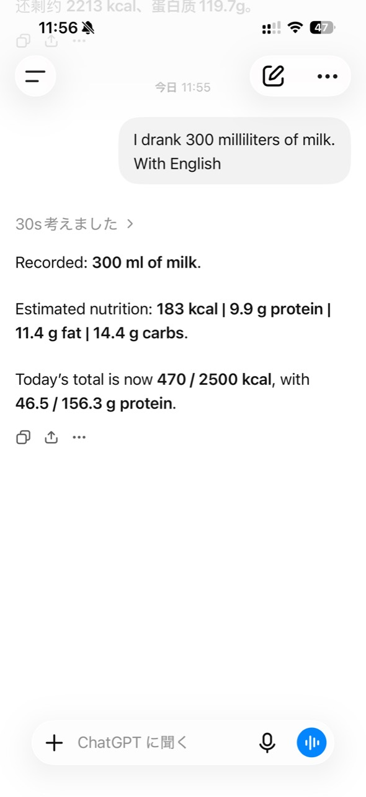
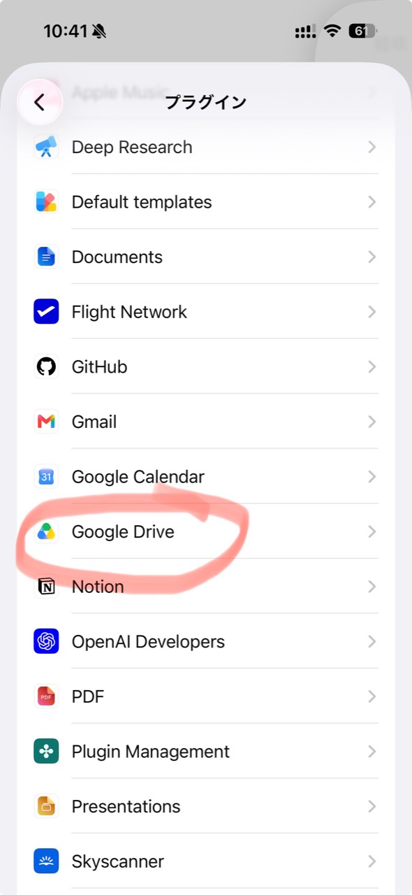

# YOUOWN Nutrition Dashboard

> **Don't build another AI app. Let the AI you already use write to data you already own.**

AI-first personal nutrition tracking with ChatGPT and your own Google Sheets.

**Language:** [中文 README](README.zh-CN.md)

---

## English


*Your day at a glance: calorie progress, estimate range, today’s focus, and macro cards.*



*Chat input: one natural-language meal note becomes a reviewable calorie and nutrient summary.*

### Three things that make it different

- **Chat is the input.** Tell the AI what you ate, review the estimate, and approve the update instead of filling in another form.
- **Your Sheet is the database.** Data stays inspectable, editable, exportable, and under your control.
- **The Dashboard stays focused.** It turns the Sheet into progress, uncertainty, alerts, forecasts, and details without becoming a second database.

### Architecture

```text
ChatGPT / another AI ── authorized update ──► Google Sheet
                                                meals / targets
                                                    │ Apps Script bridge
                                                        │ authenticated JSON
                                                        ▼
                                             YOUOWN Nutrition Dashboard
```

### AI-assisted installation (recommended)

Open Codex and say:

> Install https://github.com/Lee-Lv/YOUOWN-nutrition-dashboard/tree/main for me.

Codex will inspect the current state, reuse working resources, configure only what is missing, and verify the Dashboard → Apps Script → Google Sheet path.

See [AI installation](docs/AI_INSTALL.md), [manual setup](docs/MANUAL_SETUP.md), or [troubleshooting](docs/TROUBLESHOOTING.md) for details.

### Why this exists

I made this because I kept looking at paid health apps and thinking: I am paying for all of this, but I still do not get quite the workflow I want. Some features are things I never use, and the AI recognition is often nowhere near as useful to me as the GPT subscription I already have. This project keeps the data in a Google Sheet I control and turns that data into a private web dashboard.

I also did not want to spend weeks making a native app just to get a personal tool working. A web app is enough for this. Nutrition is just the first use case; the same idea works for trackers, household logs, training journals, collections, and small CRM tools.

### Project positioning

**A conversational, spreadsheet-backed personal dashboard template.**

Nutrition is the first example. The same pattern can support household logs, training records, medication notes, collections, personal finance, or a small CRM: use an AI conversation to update structured data, then use a focused web dashboard to understand it.

### Chat workflow and design rules

The dashboard is deliberately read-only: logging and corrections happen in a chat, then the approved data lands in the Sheet. The reusable prompt, a proposed response format, and the rules for safe Sheet edits live in [the GPT Chat workflow guide](docs/gpt-chat-prompt.md). A Chinese version is available [here](docs/gpt-chat-prompt.zh-CN.md).

The interface is meant to be the calm place where you review your day; chat is the flexible place where you describe, correct, and approve data.

### More interface examples

The assistant can use an authorized Google Drive / Google Sheets connection to work with the data source. The exact connector options depend on the account and product being used.



*Connection example: Google Drive is selected as the place where the personal data lives.*

The lower section stays compact. The chart shows actual and forecast values, records are grouped by day, and each meal opens when I want to see the details.


*History/forecast trend, daily navigation, expandable recent records, and the language selector.*

When something goes over the limit, the page becomes more direct: it says what went over, how much it went over by, and shows the 100% line plus the 120% warning zone.


*Over-target state: the warning card and macro meters make the amount over target explicit.*

### Cost and platform boundaries

I already pay for a GPT subscription, so I would rather use the AI tool I actually like for my own updates than pay another health app for features I do not need. But this project does **not** make paid APIs universally free.

- A ChatGPT subscription may include the chat, agent, connector, or web-app features available in that plan. If an everyday update happens inside ChatGPT, a separate API integration may not be necessary for that step.
- A ChatGPT subscription is **not** the same thing as OpenAI API credits. OpenAI API calls, other AI providers, automation services, and connectors may cost extra and have separate limits.
- Google Sheets and Apps Script have their own quotas and account requirements.

Verify current product capabilities, limits, and terms before relying on this cost model.

### Where things live

| Path | Purpose |
| --- | --- |
| `app/` | Dashboard routes, layout, language, and theme controls. |
| `components/` | Cards, charts, animated meters, meal accordion, and background effects. |
| `db/dashboard.ts` | Validates and normalizes the Apps Script payload. |
| `lib/` | Forecasting, calorie uncertainty, and localization. |
| `apps-script/` | Google Apps Script bridge template: `Code.gs`, generated `Schema.gs`, and the project manifest. |
| `scripts/` | Repeatable local installer, doctor, clasp setup, local build, and end-to-end verifier. |
| `config/sheet-schema.json` | Declarative schema used by the installer and generated Apps Script schema. |
| `tests/` | Forecast, uncertainty, and meal-detail checks. |

### What the Sheet needs to look like

The bridge recognizes common Chinese and English header aliases. The important `食事日志` fields are:

| Field | Example header | Used for |
| --- | --- | --- |
| Date | `日期` | Daily grouping and trend chart |
| Meal | `餐次` | Breakfast/lunch/dinner ordering |
| Food name | `食物 / 菜名` | Recent log |
| Serving | `整份描述` | Meal detail |
| Ratio | `摄入比例` | Actual consumed amount |
| Actual nutrients | `实际热量 kcal` … `实际盐分 g` | Totals and progress meters |
| Confidence | `估算依据 / 可信度` | Uncertainty range |
| Notes | `备注` | Expandable explanation |
| Stable ID | `entry_id` | Cross-system identity |
| Status | `记录状态` | Deleted rows are ignored |

`设置` uses column B: `B2:B7` for calorie/protein/fat/carbs/fiber/salt targets. `B16:B19` are optional metabolic metrics.

### Local checks

```bash
npm run lint
npm exec vite build
node --test tests/meal-accordion.test.mjs tests/calorie-uncertainty.test.mjs tests/calorie-forecast.test.mjs
```

### Installer checks

```bash
npm run doctor -- --json
npm run install:ai
```

Installer state, OAuth state, and generated secrets live under ignored `.youown/`. The state file records only IDs and token fingerprints; the actual tokens are never committed. `npm run verify` initializes missing Sheet tabs/headers without overwriting existing values, performs an authenticated disposable round trip, removes its own test row, and builds the local Dashboard.

### Where this can go next

The backing store does not have to be Google Sheets, and the assistant does not have to be ChatGPT. Any authorized combination works if it can safely update structured data and the app can read it:

- Another LLM, OCR service, or manual form can write to a Sheet/table.
- A database, Notion, Airtable, or another authorized system can replace Sheets.
- Email, iMessage, WhatsApp, WeChat, Facebook Messenger, or another messaging surface can become an input channel when an official integration path, your authorization, privacy settings, and security model are appropriate.

Do not automate account logins or scrape private services unless explicitly permitted. Prefer official APIs, exports, webhooks, or user-approved integrations.

### Public-repository checklist

- This repository is safe to publish only as a template: it contains no real Sheet ID, Apps Script URL, token, health record, or exported log.
- Never commit Sheet IDs, read tokens, health records, or exported logs.
- Restrict Apps Script deployment access and use only systems/accounts you are authorized to automate.
- Do not put credentials in an AI chat prompt, an issue, a screenshot, or a public deployment setting.

### Version

`v1.1.0` adds the first agent-installable local path: state-aware diagnosis, repeatable local secrets, Sheet/App Script reuse, local clasp isolation, explicit Google browser fallback, and an end-to-end verifier. It ships without personal credentials or health data.

### License

Licensed under the [Apache License 2.0](LICENSE).
