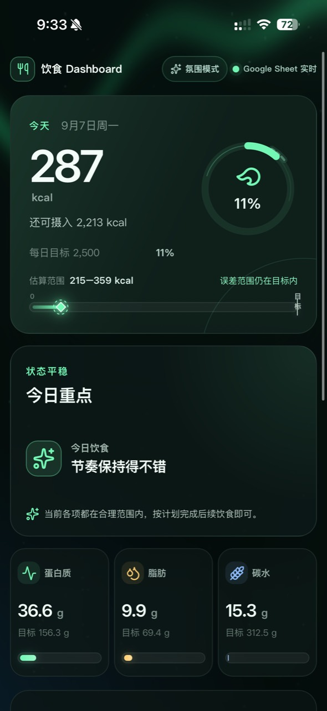
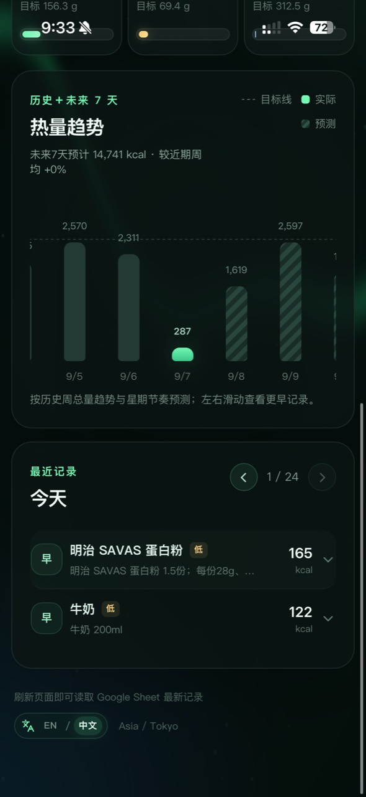
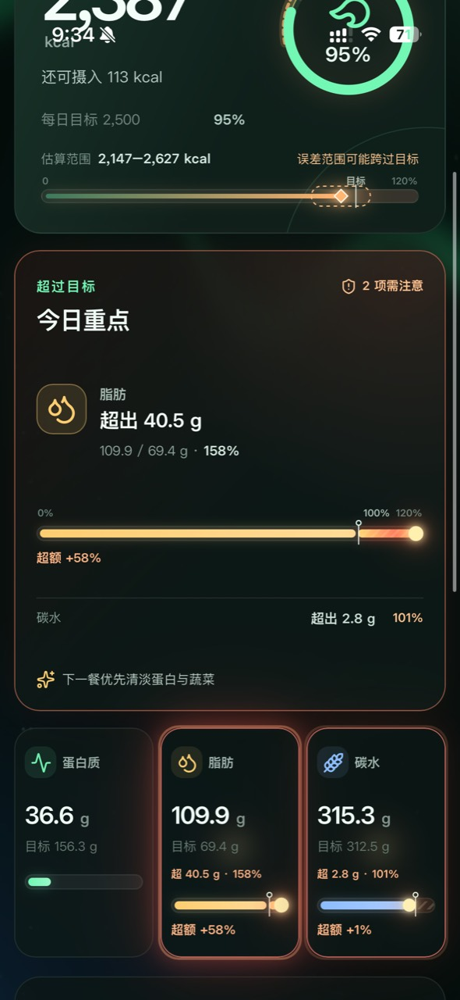

# 饮食 Dashboard

**语言：** [English README](README.md)

---

## 中文

### 为什么做这个项目

我做这个项目，其实是因为我越来越不想给那些健康管理 App 交订阅费了。付了钱以后，它们给的功能不一定是我需要的，食物识别和 AI 服务有时候也没有我自己订阅的 GPT 好。说实话，钱花了，效果却没有达到预期，有些时候我就觉得好蛋疼，不如我上。

所以就上啊！数据放在我自己的 Google Sheet 里，平时直接跟 GPT 对话，让它帮我记录、估算、修改，再用一个私有的 Web Dashboard 把结果显示出来。

我也不想为了一个自己用的东西，先花很多时间做 iOS/Android 原生 App，或者搭一套很复杂的后端。能快速上线、自己能改、数据自己掌握，对我来说就够了。
饮食只是第一个例子，个人追踪、家庭日志、训练记录、收藏管理，甚至小型 CRM，也都可以这么做。

重要的是GPT的Chat功能完全可以实现修改google sheet的内容，然后更关键的是chat无上限而且免费！（在订阅内免费，不消耗codex额度）

* 免费版GPT好像不能连接google plug 做数据写入，要确认。

### 现在能做什么

- 从 Google Sheet 读取饮食记录、营养目标和可选体重记录。
- 展示热量、三大营养素、纤维、盐分、估算误差区间、提醒、趋势和可展开的饮食明细。
- 依据历史周总量和周内波动预测未来 7 天摄入热量。
- 支持中英文界面，语言选择会保存在浏览器中。
- 通过私有 Google Apps Script JSON 桥接读取 Sheet，不需要公开整个 Sheet。
- 可选接入 Apple Health / Health Auto Export，写入体重与体脂记录。
- 源码和数据模型都在自己手里；想加功能时，直接让 AI 编程助手帮我改，不用等 App 厂商更新。

### GPT Chat 的 Prompt 和工作流方针

Dashboard 故意只负责看数据：记录和修正发生在对话里，经过确认的数据再写进 Sheet。可直接复用的 Prompt、建议的回复格式，以及安全修改 Sheet 的规则，都放在 [GPT Chat 工作流说明](docs/gpt-chat-prompt.zh-CN.md)；英文版在 [这里](docs/gpt-chat-prompt.md)。

这不是后补的说明，而是项目本身的分工：页面应该是你安静看今天数据的地方；对话才是你随手描述、修正、确认一条记录的地方。

### 我想要的感觉和界面示意

这个 Dashboard 故意做得简单一点。它主要就是拿来看数据的，不是另一套复杂的录入表单。这里不会放饮食、热量或健康数据的输入框；我想记录什么、哪里需要修改，直接在 AI 对话里说就行。AI 把得到授权的内容写进 Sheet，Dashboard 再把最新结果显示出来。

正常的时候，界面就保持安静、清楚，不需要一直提醒你。误差带只是告诉你“这个数是估算的”，绿色的今日重点会给一点简单建议。



*正常状态：每日热量进度、估算范围、今日重点和三张营养素卡片。*

下面的区域也尽量不做得复杂：图表看实际和预测，最近记录按天排列，每条记录点开就能看明细。



*历史/预测趋势、按日切换、可展开的最近记录和语言选择器。*

如果哪一项真的超了，界面就会直接告诉你是哪一项、超了多少、超过了百分之多少。进度条里也会标出 100% 目标线和 120% 警戒区，不让你只看到一条已经顶满、但不知道超了多少的条。



*超额状态：提醒卡片和营养素进度条把“超出了多少”明确显示出来。*

这些截图就是这个项目想做出来的大概样子。真正的数据源还是连接的 Sheet；页面只负责把数据讲清楚，输入和修改交给 AI 对话完成，不再另外造一套数据库。

### 我为什么觉得它值得做

```text
与 AI 对话 → 审核/修正一餐的估算 → 更新 Google Sheet → 刷新 Dashboard
                                               │
Apple Health 自动导出 ────────────────────────┘
                                               ↓
                                      你自己的私有 Web App
```

| 层级 | 做什么 | 为什么有价值 |
| --- | --- | --- |
| Google Sheet | 数据唯一来源 | 随时查看、修改、导出，数据归自己。 |
| AI 对话工作流 | 估算与日常更新 | 用自然语言修正记录，比为每个边缘情况做表单更快。 |
| Google Apps Script | 小型读写桥接 | 把 Sheet、网页和可选健康导出连接起来。 |
| 本 Web App | 展示与交互 | 不需要原生 App 的发布周期，也能有完整 Dashboard 体验。 |
| ChatGPT Sites 或其他托管 | 网页发布 | 把个人工具直接作为网页应用使用。 |

### 关于费用，我想先说清楚

我最看重的就是这一点：我已经在订阅 GPT 了，平时也更愿意用自己熟悉、觉得好用的 GPT。既然日常记录可以通过对话完成，我就不想再给一个自己觉得不好用的健康管理 App 持续交钱。

但这里要说清楚，这不代表“所有付费 API 都免费”。

- 如果你已经订阅了 ChatGPT，而且你的套餐包含对应的对话、代理、连接器或 Web Application 能力，那么日常个人记录可以在套餐限额内直接完成，不一定要另外搭一条 API 调用链。
- **ChatGPT 订阅不等于 OpenAI API 额度。** OpenAI API、其他 AI 提供商、自动化服务和第三方连接器，都可能有单独的费用、限额和条款。
- Google Sheets 与 Apps Script 也有自己的账号要求和配额。
- 使用前应确认当前产品能力、条款和限额。

所以我觉得它的意义很实际：已经订阅了一个自己觉得好用的 AI，就把它用在自己的日常工作流里。这样至少不用再为一堆自己根本不需要的功能付费，也不用忍受一个 AI 识别效果还不如 GPT 的订阅 App。钱花出去却不好用的感觉，真的很不值。

当然，具体能不能这样用，还是要看当前套餐、平台能力、配额和条款，不能把订阅当成无限 API 额度。

### 它是怎么接起来的

```text
AI 对话 / 助手 ── 已授权的数据更新 ──► Google Sheet
                                      食事日志 / 设置 / 体重
Apple Health 导出 ── 可选 POST ─────► Google Apps Script 桥接
                                               │ 带鉴权 JSON
                                               ▼
                                     你的 Nutrition Dashboard
```

Dashboard 在服务端读取 Apps Script 的 `doGet()`。桥接不可用时，如果托管环境配置了缓存/数据库层，项目会尝试该层回退。

### 仓库里各部分放在哪里

| 路径 | 作用 |
| --- | --- |
| `app/` | 页面、布局、语言与主题切换。 |
| `components/` | 卡片、图表、动态进度条、饮食明细与背景效果。 |
| `db/dashboard.ts` | 校验并规范化 Apps Script 返回的数据。 |
| `lib/` | 热量预测、估算误差和多语言逻辑。 |
| `apps-script/Code.gs` | Google Apps Script 桥接模板；复制到 Apps Script 项目中。 |
| `tests/` | 预测、误差和饮食明细测试。 |

### Sheet 里需要哪些字段

桥接支持常见中英文表头别名。当前 `食事日志` 的主要字段如下：

| 字段 | 示例表头 | 用途 |
| --- | --- | --- |
| 日期 | `日期` | 每日汇总和趋势图 |
| 餐次 | `餐次` | 早/中/晚排序 |
| 食物名称 | `食物 / 菜名` | 最近记录 |
| 份量 | `整份描述` | 展开的饮食明细 |
| 摄入比例 | `摄入比例` | 实际摄入量 |
| 实际营养 | `实际热量 kcal` … `实际盐分 g` | 每日合计和进度条 |
| 可信度 | `估算依据 / 可信度` | 热量误差区间 |
| 备注 | `备注` | 展开的估算说明 |
| 稳定 ID | `entry_id` | 跨系统识别 |
| 状态 | `记录状态` | 标为删除的行不会显示 |

`设置` 使用 B 列：`B2:B7` 是热量/蛋白质/脂肪/碳水/纤维/盐分目标；`B16:B20` 可存放代谢相关可选指标。`体重` 表是可选的，支持日期、时间、体重 kg、体脂 %、来源、原始时间戳和去重键。

### 怎么跑起来

#### 1. 创建 Google Apps Script 桥接

1. 在 Google Sheet 中选择 **扩展程序 → Apps Script**。
2. 将 [`apps-script/Code.gs`](apps-script/Code.gs) 复制进 Apps Script 编辑器。
3. 在 **项目设置 → 脚本属性（Script properties）** 中添加：

   | 属性名 | 填写内容 |
   | --- | --- |
   | `SPREADSHEET_ID` | Google Sheet URL 中的 ID。 |
   | `READ_TOKEN` | 供 Dashboard 读取的一段长随机密钥。 |
   | `WRITE_TOKEN` | 启用健康数据 POST 时填写另一段不同的长随机密钥。 |

4. 部署为 **Web app**。执行身份选择 Sheet 所有者；访问范围尽量收紧。
5. 用 `/exec?token=YOUR_READ_TOKEN` 测试；正常时应返回含 `ok: true` 的 JSON。

> 仓库脚本不含任何真实 ID 或 Token。真实凭据只能保存在 Script Properties 和托管平台的秘密环境变量中，不能提交到 Git。

#### 2. 配置 Dashboard 运行时

| 变量 | 内容 |
| --- | --- |
| `GOOGLE_SHEET_ENDPOINT` | Apps Script Web app 的 `/exec` URL |
| `GOOGLE_SHEET_TOKEN` | 与 `READ_TOKEN` 相同的值 |

不要把这些值提交到 `.env`、代码、截图或公开聊天记录中。

#### 3. 可选：Apple Health / Health Auto Export

将导出地址设为 `/exec?writeKey=YOUR_WRITE_TOKEN`，发送包含时间戳、体重/身体质量类型、数值及可选单位的 JSON。模板识别 kg、lb，以及小数或百分比形式的体脂。先做小范围测试，再启用大范围历史导出。

部分健康导出 App 无法稳定把自定义 Header 转发给 Apps Script Web app，因此模板支持 query 中的 `writeKey`。这会让 URL 本身成为秘密：不要分享它；一旦泄露，请立即轮换 `WRITE_TOKEN`。

### 本地检查

```bash
npm run lint
npm exec vite build
node --test tests/meal-accordion.test.mjs tests/calorie-uncertainty.test.mjs tests/calorie-forecast.test.mjs
```

### 以后还能怎么扩展

数据源不一定非要是 Google Sheet，AI 也不一定非要是 ChatGPT。只要某个系统能安全更新结构化数据，而应用可以读取它，下面的组合都成立：

- 其他 LLM、OCR 服务或手动表单写入 Sheet/数据表。
- Google Sheet 换成数据库、Notion、Airtable 或其他有授权的数据源。
- 邮件、iMessage、WhatsApp、微信、Facebook Messenger 等聊天入口可作为输入渠道，但前提是有官方可用的集成方式、你拥有授权、隐私设置和安全模型都合适。

不要在未获服务明确允许的情况下自动化登录账户或抓取私有服务。优先使用官方 API、导出、Webhook 或用户明确授权的集成方式。

### 公开仓库前的检查清单

- 这个仓库只能以“模板”的形式公开：其中不包含真实 Sheet ID、Apps Script 地址、Token、健康记录或导出日志。
- 不要提交 Sheet ID、读写 Token、健康记录或导出日志。
- 读取和写入使用不同 Token；任一泄露后立即轮换。
- 收紧 Apps Script 的部署访问范围，并只自动化你有权限操作的系统和账户。
- 不要把凭据写进 AI 对话 Prompt、GitHub Issue、截图或公开的部署配置里；Apps Script 的写入 URL 也应视作秘密。

### 版本

`v1.0.0` 是这个开源模板的首个发布版本；不包含任何个人凭据或健康数据。
